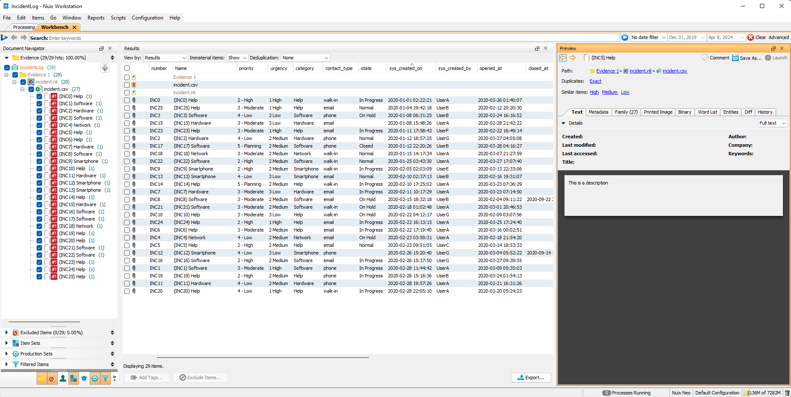
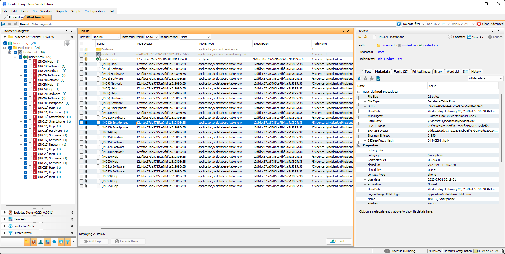

# ProServ-NLI-Builder

This is a library for building Nuix Logical Image (NLI) files for ingesting data into Nuix cases.

## Background

An NLI is a container wrapped around an EDRM v 1.2 XML load file.  This tool provides a Python (and eventually a Java)
framework to prepare data for ingestion.  The NLI container is a convenient tool for converting various structured and
unstructured data from a variety of sources into a format that is easily digested by Nuix.  This tool smooths that
processes by laying down a framework that does the work of creating the EDRM XML file, structures the NLI directory
structure, and generates the NLI container.  What is left for the user is to add files to the container, and, when 
necessary, add extensions to the formats provided by the tool.

# Contents

* [Using the Python Tool](#python)
  * [End to End Example Walkthrough](#end-to-end-example)
  * [Basics: Building an NLI](#building-a-nuix-logical-image)
  * [Basics: Using the Release](#using-the-python-release)
  * [Customizing: Fields on Entries](#customizing-entries)
  * [Customizing: New Types of Entries](#customizing-entries)
  * [CSV Files](#customizing-csv-file-formats)


# Using the NLI Builder

## End to End Example

In this example, we will start with a CSV file that logs some customer support activity, such as this:

number|sys_created_on|sys_created_by|opened_at|resolved_at|reopened_time|activity_due|closed_at|closed_by|due_date|sla_due|contact_type|category|urgency|short_description|priority|state|escalation
------|--------------|--------------|---------|-----------|-------------|------------|---------|---------|--------|-------|------------|--------|-------|-----------------|--------|-----|----------
INC0|2020-01-01 02:22:21|UserA|2020-03-26 01:40:07|2020-06-06 13:34:48| | | |UserC|2020-05-17 22:15:02| |walk-in|Help|1 High|This is a description|2 - High|In Progress|Moderate
INC1|2020-02-28 11:44:42|UserA|2020-03-09 05:35:03| | |2020-04-13 09:16:21| |UserA| | |phone|Software|1 High|This is a description|3 - Moderate|In Progress|New
INC2|2020-01-12 18:57:25|UserG|2020-03-27 04:05:08| | |2020-03-25 00:06:29| |UserB| |2020-06-05 07:38:10|phone|Hardware|2 Medium|This is a description|4 - Low|Normal|
INC3|2020-01-08 06:31:25|UserB|2020-02-24 16:16:52| | | | |UserB| | |phone|Software|3 Low|This is a description|4 - Low|On Hold|Overdue

Our goal is to ingest the CSV into Nuix so it can be represented in a meaningful way:


See the [incidence.csv](python/resources/incident.csv) file in the Python package's resource folder for the full file.

Given this CSV, we want the following:
* The `number` represents the unique identifier for the item
* The `sys_created_on` represents the Item Date
* The `short_description` represents the text we want to associate with the item
* To provide a meaningful name will combine the `number` and `category`

To accomplish this, we will create a subclass of `CSVRowEntry` to provide that information:

```Python
from nuix_nli_lib.data_types import CSVEntry, CSVRowEntry
from datetime import datetime


class IncidentEntry(CSVRowEntry):
    def __init__(self, parent_csv: CSVEntry, row_index: int):
        super().__init__(parent_csv, row_index)

    @property
    def identifier_field(self) -> str:
        return 'number'

    def get_name(self) -> str:
        return f'({self['number'].value}) {self['category'].value}'

    @property
    def text(self) -> str:
        return self['short_description'].value

    @property
    def time_field(self) -> str:
        return 'sys_created_on'

    @property
    def itemdate(self) -> datetime:
        return datetime.strptime(self[self.time_field].value, '%Y-%m-%d %H:%M:%S')
```

In this walkthrough, we will use the interactive Python interpreter to create our target NLI.  we launch it with the
`nli_builder.bat`

```Console
C:\NLI-Builder\runtime>.\python\python.exe -i .\python\init_nuix_nli_env.py


     #########      ###**###
   #*#*######**###***######***#
 #**##**#****###*####*******####
 **##**#**#########*##*#**#**##*#
#**#*#***##*###**#*##**###*#*##*##    ##**#####*****###    ##****        *****#  ##*### ##**#        ##*##
#*#**#**#   #######*##  ##*#**####   #****************##  #*****#       ##***** #*****# #*****#    ##****#*
 #*#*#*#**#  #**##*#*  ##*##**#*#    #*******#####******# #*****#       #*****# #******  #*****#  #******#
 #####*###### ##***  #*###*#*##*     #******#      ******##*****#       #*****# #******   ##****##*****#
   #*##**#***#  ## ###*##*##**#      #*****#       *****#*#*****#       #*****# #******     #********##
    #**##**##**   ***##**##**#       #*****#       ##*****#*****#       #*****# #******      ##*****#
   ***######**     #####*#*#**#      #*****#       ##*****#*****#       #*****# #******     #********#
 #**##**##**# ##**#  #*##*###*##     #*****#       ##*****##****##      #*****# #******   ##***********#
#*###*##**#  #**##*#   ####**##*#    #*****#       ##***** #*****### ##*#*****# #******  #******# *#****#
#*##*#####  #####*#*##  #**##*##*#   #*****#       ##*****  ##**********#*****# #****** ##****#    #*****##
#*#**##*# #####*#*#*##*  #**#**#*#    #*****       #*****#   ###********#****## #****## ****##       ****##
**##*###**#*###* #**###**###**####     ###           ###        ##*###    ####    ###    ###          ##*
 ##*###*####*###**##**#*****#####
  #**####*####**#*#*##*#*###**##
    ##*#***#*##    ##*****#*##


Nuix Logical Image Builder: the nuix_nli_lib packages and its children are available.  Start with:
 --------------------------
 |  nli = NLIGenerator()  |
 --------------------------
>>>
```

First thing to do would be to create the class, as shown above:

> 📝 **Note**: It would be best to save this class to a .py file and import it into the interpreter, but for this
> demo we are creating the class directly in the interactive interpreter.


```Python
>>> class IncidentEntry(CSVRowEntry):
...     def __init__(self, parent_csv, row_index):
...         super().__init__(parent_csv, row_index)
...
...     @property
...     def identifier_field(self):
...         return 'number'
...
...     def get_name(self):
...         return f'({self['number'].value}) {self['category'].value}'
...
...     @property
...     def text(self):
...         return self['short_description'].value
...
...     @property
...     def time_field(self):
...         return 'sys_created_on'
...
...     @property
...     def itemdate(self):
...         return datetime.strptime(self[self.time_field].value, '%Y-%m-%d %H:%M:%S')
...
>>>
```

Then we use this as the row_generator when building a CSVEntry:

```Python
>>> incident_entry = CSVEntry(Path(r'C:\NLI-Builder\resources\incident.csv'), row_generator=IncidentEntry)
```

Finally, build and save the NLI file:

```Python
>>> nli = NLIGenerator()
>>> nli.add_entry(incident_entry)
'0a6193c422ee480d2a0f44b8475c6bc48a2a74fa'
>>> nli.save(Path(r'C:\projects\proserv\nli\incident.nli'))
```

To show all the steps, as entered into the interpreter:

```Python
C:\NLI-Builder\runtime>.\python\python.exe -i .\python\init_nuix_nli_env.py


     #########      ###**###
   #*#*######**###***######***#
 #**##**#****###*####*******####
 **##**#**#########*##*#**#**##*#
#**#*#***##*###**#*##**###*#*##*##    ##**#####*****###    ##****        *****#  ##*### ##**#        ##*##
#*#**#**#   #######*##  ##*#**####   #****************##  #*****#       ##***** #*****# #*****#    ##****#*
 #*#*#*#**#  #**##*#*  ##*##**#*#    #*******#####******# #*****#       #*****# #******  #*****#  #******#
 #####*###### ##***  #*###*#*##*     #******#      ******##*****#       #*****# #******   ##****##*****#
   #*##**#***#  ## ###*##*##**#      #*****#       *****#*#*****#       #*****# #******     #********##
    #**##**##**   ***##**##**#       #*****#       ##*****#*****#       #*****# #******      ##*****#
   ***######**     #####*#*#**#      #*****#       ##*****#*****#       #*****# #******     #********#
 #**##**##**# ##**#  #*##*###*##     #*****#       ##*****##****##      #*****# #******   ##***********#
#*###*##**#  #**##*#   ####**##*#    #*****#       ##***** #*****### ##*#*****# #******  #******# *#****#
#*##*#####  #####*#*##  #**##*##*#   #*****#       ##*****  ##**********#*****# #****** ##****#    #*****##
#*#**##*# #####*#*#*##*  #**#**#*#    #*****       #*****#   ###********#****## #****## ****##       ****##
**##*###**#*###* #**###**###**####     ###           ###        ##*###    ####    ###    ###          ##*
 ##*###*####*###**##**#*****#####
  #**####*####**#*#*##*#*###**##
    ##*#***#*##    ##*****#*##


Nuix Logical Image Builder: the nuix_nli_lib packages and its children are available.  Start with:
 --------------------------
 |  nli = NLIGenerator()  |
 --------------------------
>>> class IncidentEntry(CSVRowEntry):
...     def __init__(self, parent_csv, row_index):
...         super().__init__(parent_csv, row_index)
...
...     @property
...     def identifier_field(self):
...         return 'number'
...
...     def get_name(self):
...         return f'({self['number'].value}) {self['category'].value}'
...
...     @property
...     def text(self):
...         return self['short_description'].value
...
...     @property
...     def time_field(self):
...         return 'sys_created_on'
...
...     @property
...     def itemdate(self):
...         return datetime.strptime(self[self.time_field].value, '%Y-%m-%d %H:%M:%S')
...
>>> incident_entry = CSVEntry(Path(r'C:\NLI-Builder\resources\incident.csv'), row_generator=IncidentEntry)
>>> nli = NLIGenerator()
>>> nli.add_entry(incident_entry)
'0a6193c422ee480d2a0f44b8475c6bc48a2a74fa'
>>> nli.save(Path(r'C:\projects\proserv\nli\incident.nli'))
```

The result is the incident.nli file saved in the specified path.  This can be imgested into Nuix to create a case
such as this:



After that, a Metadata Profile could be made to view the properties in a more natural format:


## Python

> 📝 **Note**: The Python library uses only standard libraries, no third party dependencies.  It was written against
> Python 3.12.  The Release will have a complete Python environment to run the tool with

This tool provides a Python package named `nuix_nli_lib`, which contains three sub-packages, `edrm`, `data_type`, and 
`nli`.

### Building a Nuix Logical Image

1. Create an instance of the nuix_nli_lib.nli.NLIGenerator class
2. Add entries to the generator
   * For standard files, directories, or mappings, you can use the basic `add_file`, `add_directories`, and `add_mapping` methods
   * For CSV files, create an instance of nuix_nli_lib.data_types.CSVEntry and use NLIGemerator's `add_entry`
   * The `add_entry` method can also be used for other custom implementations of the EntryInterface class (see _Customizing Entries_ below.)
3. Once all the entries are added, call the `save(Path)` method to package the NLI contents and save it to the specified location

```Python
from nuix_nli_lib.nli import NLIGenerator
from pathlib import Path

nli = NLIGenerator()
l1 = nli.add_directory('Level 1')
d1 = nli.add_file('Doc 1.txt', 'text/plain', l1)
d2 = nli.add_file('Doc 2.txt', 'text/plain', l1)
l2 = nli.add_directory('Level 2', l1)
m1 = nli.add_directory({'Name': 'Map 1', 'CreateTime': '2023-04-07 11:03:37.435', 'key 1': 'value 1'}, 'application/x-database-table-row`, l2)
nli.save(r'C:\data\evidence\sample.nli')
```
The aboce code would produce an NLI that will ingest into a Nuix case to produce the following evidence structure:

    Evidence 1
    |- sample.nli
       |- Level 1
          |- Doc 1.txt
          |- Doc 2.txt
          |- Level 2
             |- Map 1


> 📝 **Note**: Although you can run Python (Jython) code in the Nuix engine, this tool is designed to run stand-alone
> and will not run on the Engine.  The tool is meant to run stand-alone or to run in a pre-Nuix environment to ge data
> ready to be ingested into Nuix

### Using the Python Release

The Python Release for this package includes a Python v3.12 Runtime Environment for Windows x64 operating Systems and a
batch file which can be used to launch an interactive Python environment, allowing you to use the tool without an 
existing Python application or environment.

1. Download the latest Release for Python
2. Unzip the release
3. Locate and run the `nli_builder.bat` file by double-clicking on it

```Python
C:\Nuix-NLI-Builder>.\python\python.exe -i .\python\init_nuix_nli_env.py


     #########      ###**###
   #*#*######**###***######***#
 #**##**#****###*####*******####
 **##**#**#########*##*#**#**##*#
#**#*#***##*###**#*##**###*#*##*##    ##**#####*****###    ##****        *****#  ##*### ##**#        ##*##
#*#**#**#   #######*##  ##*#**####   #****************##  #*****#       ##***** #*****# #*****#    ##****#*
 #*#*#*#**#  #**##*#*  ##*##**#*#    #*******#####******# #*****#       #*****# #******  #*****#  #******#
 #####*###### ##***  #*###*#*##*     #******#      ******##*****#       #*****# #******   ##****##*****#
   #*##**#***#  ## ###*##*##**#      #*****#       *****#*#*****#       #*****# #******     #********##
    #**##**##**   ***##**##**#       #*****#       ##*****#*****#       #*****# #******      ##*****#
   ***######**     #####*#*#**#      #*****#       ##*****#*****#       #*****# #******     #********#
 #**##**##**# ##**#  #*##*###*##     #*****#       ##*****##****##      #*****# #******   ##***********#
#*###*##**#  #**##*#   ####**##*#    #*****#       ##***** #*****### ##*#*****# #******  #******# *#****#
#*##*#####  #####*#*##  #**##*##*#   #*****#       ##*****  ##**********#*****# #****** ##****#    #*****##
#*#**##*# #####*#*#*##*  #**#**#*#    #*****       #*****#   ###********#****## #****## ****##       ****##
**##*###**#*###* #**###**###**####     ###           ###        ##*###    ####    ###    ###          ##*
 ##*###*####*###**##**#*****#####
  #**####*####**#*#*##*#*###**##
    ##*#***#*##    ##*****#*##


Nuix Logical Image Builder: the nuix_nli_lib packages and its children are available.  Start with:
 --------------------------
 |  nli = NLIGenerator()  |
 --------------------------
>>>
```

From the interactive command line, you can then start typing the commands needed to create the NLIGenerator, add
entries to it, and save the final NLI file.  Press CTRL-Z when done to exit the interpreter.

The folder containing the `nli_builder.bat` is added the Python search path, so additional modules, such as customized
extensions to the existing entry types, can be added directly in the same folder.  Additionally, most of the relevant
tools in the nuix_nli_lib package and its sub packages are already imported into the environment, as is the 
pathlib.Path module, so most classes and functions can be used without additional imports.

In addition to the interactive Python interpreter, the Source Code present in the release can also be used as a library
in your own Python applications or scripts.  To do so, place the `nuix_nli_lib` package in your Python search path
and add the following imports to your application:

```Python
from nuix_nli_lib import edrm
from nuix_nli_lib import nli
from nuix_nli_lib import data_types

from nuix_nli_lib.edrm import EntryInterface, FileEntry, DirectoryEntry, MappingEntry, EDRMBuilder, generate_field
from nuix_nli_lib.data_types import CSVEntry, CSVRowEntry, JSONValueEntry, JSONArrayEntry, JSONObjectEntry, JSONFileEntry
from nuix_nli_lib.nli import NLIGenerator
```
> 📝 **Note**: This effectively imports everything you might need to interact with.  For any particular use-case, you
> can import less.  The minimum being just the NLIGenerator.

### Python Dependencies

The `nuix_nli_lib` package uses only standard libraries that come with Python 3.12.  It has no additional dependencies
to install.

### Customizing Entries

The tool comes with three basic Entry types:

nuix_nli_lib.edrm.FileEntry
: A File on the file system.  A FileEntry will have a native file associated with it and will not act as a container or
parent to other entries.  A file can be added to the NLI file using the `nuix_nli_lib.edrm.NLIGenerator#add_file(...)`
method, or by directly instantiating the FileEntry class.  Either way you will the path to the file, the mimetype to
assign to the file, and, optionally, a string representing the file's parent's ID.

nuix_nli_lib.edrm.DirectoryEntry
: A Directory or folder to create in the final Case the NLI will populated.  A DirectoryEntry will not have any native
file associated with it, but can act as a container / parent for other entries.  A directory can be added to the NLI
file using the `nuix_nli_lib.edrm.NLIGenerator#add_directory(...)` method or by directly instantiating the 
DirectoryEntry class.  Either way, you will need the name of the directory and, optionally, a string representing the
directory's parent's ID.  Each directory represents a single container layer in the case, to make several layers you
need to add and nest several DirectoryEntry instances, one for each layer, using the parent ID parameters to ensure they
get nested appropriately

nuix_nli_lib.edrm.MappingEntry
: An item in the case with a series of custom fields.  A MappingEntry is a vector for Key:Value pairs and its main 
purpose is to deliver those pairs into the Case as Properties on an item.  However, a MappingEntry will produce its 
dictionary of data as a text file present as a Native in the NLI.  A MappingEntry will not act as a container or parent 
of other entries.  A mapping can be added to the NLI file using the `nuix_nli_lib.edrm.NLIGenerator#add_mapping(...)` 
method or by directly instantiating the MappingEntry class.  Either way, you will need to supply a dictionary for the 
Key:Value pairs, a mimetype to assign to the mapping, and, optionally, a string to use as the mapping's parent ID.

In addition to these three basic Entry types, the tool provides some advanced sub-classes in the 
`nuix_nli_lib.data_types` package.  These are:

**CSV Files**

CSV file support is provided through the `nuix_nli_lib.data_types.csv_files` module, which provides two classes.

CSVEntry
: This subclass of the `nuix_nli_lib.edrm.FileEntry` will read a CSV file from disk.  It will represent the Native of
that file in the NLI file, and add a CSVRowEntry instance for each row of data to the NLI.  This class also extends the
FileEntry to allow it to both serve as a Native, and act as a Container for other items (as it becomes the parent for
each CSVRowEntry it adds)

CSVRowEntry
: This subclass of the `nuix_nli_lib.edrm.MappingEntry` represents one row in a CSV file.  It will be created and 
managed by the CSVEntry, so there is no need to create them manually.  However, as seen below, when you need to support
custom formats for CSV files, such as to define a special naming convention, Item Date field, or data to store as the 
Text component, it will be normal to subclass this CSVRowEntry class, rather than the CSVEntry class

**JSON Files**

JSON file support is provided through the `nuix_nli_lib.data_types.json_files` module, which provides four classes.

JSONFileEntry
: This subclass of the `nuix_nli_lib.edrm.FileEntry` will read the JSON file from disk and parse it to an in-memory
structure.  When the `#add_to_builder` method is used to add the file to an NLI, it will also add child items for its
content.  This class also extends the FileEntry to allow it to both serve as a Native, and act as a Container for other
items (it will become parent to exactly one item, a JSONValueEntry, JSONArrayEntry, or JSONObjectEntry depending on the
file's content).

JSONValueEntry
: This class represents a single, simple value in a JSON file.  It is possible that a JSON file contains just a single,
simple value, such as a String, number, boolean, or Null.  When that happens, this class will be used to represent the
data and added as a child to the JSONFileEntry.  For other data, when a simple value is reached this class will be used
to parse and translate the value to store as a property on its containing item.  Items with this type will have a single
property containing its value, and the Text will also store the value.  This class does not allow child items.

JSONArrayEntry
: This class represents a JSON array.  JSON arrays are complex types that can contain simple values (strings, numbers,
and Null) as well as nested complex types (arrays and objects).  Simple values will be stored in the array as properties
and complex values as child items with their index being used as the item's name.  The text for this item type will be 
a comma separated list of the simple values (not nested complex values), and this type can have child items.

JSONObjectEntry
: This class represents a JSON object.  JSON objects are complex types with key-value pairs, the keys must be strings
and the values can be either simple values or nested complex types.  Simple values will be stored as properties with
their key being the property's name.  Complex values will be stored as child items with the key being used as the child
item's name.

#### Adding additional properties to Entries

Each Entry will come with a standard set of properties:

**FileEntry and DirectoryEntry**
* Name
* Item Date
* SHA-1
* MIME Type
* Path Name
* File Accessed
* File Created
* File Modified
* File Owner (when available)
* File Size

**MappingEntry**
* Name
* Item Date (when available)
* SHA-1
* MIME Type

Additional fields can be added to an entry by using one of the base entry types (FileEntry, DirectoryEntry, or 
MappingEntry though this last one is unusual for this use-case as all the properties needed can be assigned to the
original dictionary used to create the entry), using the `nuix_nli_lib.edrm.FieldFactory#generate_field(...)` to make
the new field, assign it a value, then assign the Field to the entry:

```Python
from nuix_nli_lib.edrm import FileEntry, generate_field, EntryField

d1 = FileEntry('doc1.txt', 'text/plain')
geo_loc = generate_field('Geo Location', EntryField.TYPE_TEXT, '')
geo_loc.value = '38.894559, -77.035926'
d1['Geo Location'] = geo_loc
```

To add the same field to multiple documents, you would need to make multiple copies, not just reassign the value:

```Python
from nuix_nli_lib.edrm import FileEntry, generate_field, EntryField
from copy import deepcopy

geo_loc = generate_field('Geo Location', EntryField.TYPE_TEXT, '')
geo_loc.value = '38.894559, -77.035926'
d1 = FileEntry('doc1.txt', 'text/plain')
d1['Geo Location'] = geo_loc

geo_loc = deepcopy(geo_loc)
geo_loc.value = '38.887793, -77.047389'
d2 = FileEntry('doc2.txt', 'text/plain')
d2['Geo Location'] = geo_loc
```

#### Further Customizing the Base Entry Types

All base entry types, those in the `nuix_nli_lib.edrm` package are extensions of the  `EntryInterface` class.  To
make additional customizations, you can either extend the same class, or you can extend one of the other base types
that closer matches your desired behavior.  For example to create a type that has similar properties as a FileEntry but
allows it to act as a parent.

The easiest means of doing that would be to extend the FileEntry and modify the `add_as_parent_path(...)` method to
pre-pend its own name to the existing path.

```Python
from nuix_nli_lib.edrm import FileEntry

class ContainerFileEntry(FileEntry):
    def add_as_parent_path(self, existing_path: str):
        return f'{self.name}/{existing_path}'
```

#### Customizing CSV File Formats

The `nuix_nli_lib.data_types` package has a set of advanced types of the EntryInterface implementations.  The first is
the CSVEntry, an entry specific for CSV files.  Using a CSVEntry is pretty similar to using other entry types, except
you need to use the `NLIGenerator#add_entry(...)` method to add it to the NLI (rather than one of the othe `add_...` 
methods).

```Python
from nuix_nli_lib.nli import NLIGenerator
from nuix_nli_lib.data_types import CSVEntry
from pathlib import Path

nli = NLIGenerator()
csv_e = CSVEntry(r'C:\data\evidence\source.csv')
nli.add_entry(csv_e)
nli.save(Path(r'C:\data\evidence\output\sample.nli'))
```

This will use the default implementation of the `CSVRowEntry` class, which has some rules for finding a name for the
entry that gets added per row, rules for finding the value to assign to the Item Date field, and will produce all of the
CSV row's data as its Text content in a dictionary (Key:Value) format.  It is likely that you will need to customize
this behavior:
* To look up or create a custom name for the case item based on one or more columns in the CSV
* To look up or create a field to use for the Item Date field, if the CSV Row should be placed in a timeline
* To assign a specific Date Time Format of said Item Date if it isn't stored in the default format (`%Y-%m-%dT%H:%M:%S.%f` which is like `2024-04-07T18:52:13.4583601`)
* To produce custom text to store based on one or more fields, or in a different format than a set of Key:Value pairs
* To allow rows of data to have parent-child relationships
* etc...

In this example, a common extension of the CSVRowEntry is made that will provide its own unique identifier, its own 
name, Item Date and format, and its own text output:

```Python
class TagRowEntry(CSVRowEntry):
    '''
    Tag ID  |  Location          |  Tag Description                   |  Applied Date   |  Adjusted Date |  Owner   | ...
    ---------------------------------------------------------------------------------------------------------------------
    RF435   | Asymetric Trans.   |  Some important information that...| 04/07/21        |  04/03/24      | CL3-0034 | ...
    '''
    def __init__(self, parent_csv: CSVEntry, row_index: int):
        super().__init__(parent_csv, row_index)

    @property
    def identifier_field(self) -> str:
        return 'Tag ID'

    def get_name(self) -> str:
        return f'({self['Tag ID'].value}) {self['Location'].value}'

    @property
    def text(self) -> str:
        return self['Tag Description'].value

    @property
    def time_field(self) -> str:
        return "Applied Date"

    @property
    def itemdate(self) -> datetime:
        return datetime.strptime(self[self.time_field].value, '%m/%d/%y')
```

> 📝 **Note**: Notice the class overrides the `get_name` function rather then the `name` property to produce a valid
> name for the item.  The name will be used for multiple purposes, one of which is a potential Native file to be
> ingested.  File names need special rules, and the `name` property applies those rules.  The `get_name` is the
> correct method to use in this case, as it would allow the name to be corrected by the property, without having to
> re-write the required transformations.

To use this custom CSVRowEntry, you pass the class to the `row_generator` parameter when creating the CSVEntry, 
overriding the default use of the CSVRowEntry class:

```Python
from nuix_nli_lib.nli import NLIGenerator
from nuix_nli_lib.data_types import CSVEntry
from pathlib import Path
from tag_row_entry import TagRowEntry

nli = NLIGenerator()
csv_e = CSVEntry(r'C:\data\evidence\source.csv', TagRowEntry)
nli.add_entry(csv_e)
nli.save(Path(r'C:\data\evidence\output\sample.nli'))
```
